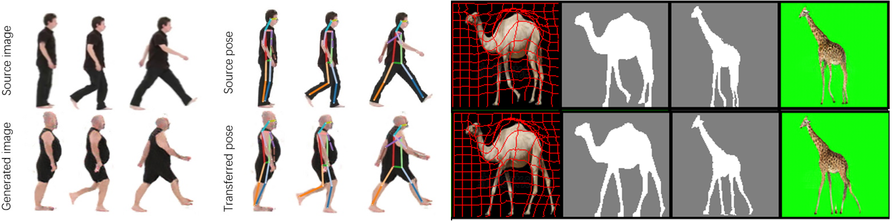
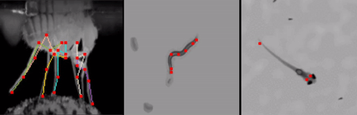

# Deformation-aware Unpaired Image Translation for Pose Estimation on Laboratory Animals
#### [Video](https://www.youtube.com/watch?v=bVhdF_JJLZ0) | [Paper](http://openaccess.thecvf.com/content_CVPR_2020/papers/Li_Deformation-Aware_Unpaired_Image_Translation_for_Pose_Estimation_on_Laboratory_Animals_CVPR_2020_paper.pdf) | [Poster](./imgs/Deformation_aware_CVPR2020_poster.pdf)
Siyuan Li, Semih Günel, Mirela Ostrek, Pavan Ramdya, Pascal Fua, Helge Rhodin. In CVPR 2020.



We propose a method to transfer synthetic images and their keypoint annotations to realistically looking images using
only unpaired examples of the two domains. Our method enables training of a pose detector that can be applied to real
images for neuroscientific studies.


## Getting started
These instructions will get you a copy of the project up and running on your local machine.

### Clone the repo and install dependencies:
Clone this repo:
```
git clone https://github.com/siyliepfl/deformation-aware-unpaired-image-translation.git
```
Install dependencies:
```
pip install -r requirements.txt
```

### Dataset preparation
You can download animal datasets from [here](https://drive.google.com/drive/folders/16A0aPG7takJRat5866sojS1s548gTdmN?usp=sharing).
Note that for real images we can only provide drosophila dataset for now. For C. elegans and Zebra fish, we don't own the data. If you need those data, you can find the sources from our paper.

Put the download models in folder
```
./dataset
```

### Pretrained models
Download pretrained models [here](https://drive.google.com/drive/folders/1S7dDPHPej5HlP_VniIEu771oX3CWbZvc?usp=sharing) and put the download models in following folder
```
./saved_models
```

## Running the tests

You can download the pretrained model and test as following. If you want to train the model by yourself, please follow the steps in next sections.

### Unpaired image translation and annotation transfer
The main part of our model is to transfer the images and annotations across domains. 
This model can transfer the synthetic images to real and also generate annotations which can be used for training a pose estimation network. You can run following commands and check generate images and annotations in result dir.

* Drosophila
```
python test.py --dataroot ./dataset/unpaired_dataset/fly/ --name fly --model deform_transfer --gpu_ids 0 --dataset_mode unpaired --num_test 100 --transfer_anno --render_pose --which_animal fly
```

* C.elegans
```
python test.py --dataroot ./dataset/unpaired_dataset/worm/ --name worm --model deform_transfer --gpu_ids 0 --dataset_mode unpaired --num_test 100 --transfer_anno --render_pose --which_animal worm --input_nc 1 --output_nc 1 --source_anno_dir ./dataset/unpaired_dataset/worm/syn_anno.pth 
```

* Zebra Fish
```
python test.py --dataroot ./dataset/unpaired_dataset/fish/ --name fish --model deform_transfer --gpu_ids 0 --dataset_mode unpaired --num_test 100 --transfer_anno --render_pose --which_animal fish --input_nc 1 --output_nc 1 --source_anno_dir ./dataset/unpaired_dataset/fish/syn_anno.pth 

```

### Pose estimation


Pose estimation model is a standard stacked hourglass network described in the [paper](https://arxiv.org/abs/1603.06937). You can also use other pose estimation models.
Previous step generate both realistic images and annotations. Then, we can use the generated data to train a pose estimation network. You can download our [pretrained models](https://drive.google.com/drive/folders/1S7dDPHPej5HlP_VniIEu771oX3CWbZvc?usp=sharing) and test as following.  

* Drosophila
```
python test.py --dataroot ./dataset/test/fly/  --name fly --model pose --gpu_ids 0 --input_nc 1 --output_nc 30 --netG pose --dataset_mode pose --target_anno_dir ./dataset/test/fly/test_anno.pth --pose_img_dir ./dataset/test/fly/imgs/  --render_pose --which_animal fly --pose_mode --evaluate --transfer_anno
```
* C.elegans
```
python test.py --dataroot ./dataset/test/worm/  --name worm --model pose --gpu_ids 0 --input_nc 1 --output_nc 7 --netG pose --dataset_mode pose --target_anno_dir ./dataset/test/worm/test_anno.pth --pose_img_dir ./dataset/test/worm/imgs/  --render_pose --which_animal worm --pose_mode --evaluate --transfer_anno
```
* Zebra Fish
```
python test.py --dataroot ./dataset/test/fish/  --name fish --model pose --gpu_ids 0 --input_nc 1 --output_nc 3 --netG pose --dataset_mode pose --target_anno_dir ./dataset/test/fish/test_anno.pth --pose_img_dir ./dataset/test/fish/imgs/  --render_pose --which_animal fish --pose_mode --evaluate --transfer_anno
```

## Train the models

### Setup visdom server for visulization

```
python -m visdom.server
```

### Initial phase
To make the training easier, we need to initlize the deformation grid to identity mapping.
You can either train it or download our pretained init model [here](https://drive.google.com/drive/folders/1S7dDPHPej5HlP_VniIEu771oX3CWbZvc?usp=sharing)

You can also train it by running:
```
python train.py --dataroot ./dataset/unpaired_dataset/ANIMALS/ --name ANIMALS_init --model deform_transfer  --lr 2e-5 --niter 100 --niter_decay 100  --save_epoch_freq 200 --save_latest_freq 1000 --lambda_TV 1 --lambda_S 0 --lambda_affine 1e7 --lambda_bias 1e6  --dataset_mode unpaired --init_mode

```
* ANIMALS: the name of your dataset and model. For instance, fly, worm or fish.

### Train unpaired image and annotation transfer models

* Drosophila
```
python ./train.py --dataroot ./dataset/unpaired_dataset/fly/ --name fly --init_dir ./saved_models/fly_init/ --model deform_transfer  --lr 2e-5 --niter 50 --niter_decay 0 --gpu_ids 0 --batch_size 4 --save_epoch_freq 2 --lambda_I 1e-5  --lambda_identity 1 --lambda_TV 1e-3 --lambda_S 1 --lambda_affine 1 --lambda_bias 1e-2  --dataset_mode unpaired --lr_GS 2e-5 --lr_DS 2e-6 --lr_GI 2e-3 --lr_DI 2e-3
```

* C.elegans
```
python train.py --dataroot ./dataset/unpaired_dataset/worm/ --name worm --init_dir ./saved_models/worm_init/ --model deform_transfer  --lr 2e-5 --niter 70 --niter_decay 0 --gpu_ids 0 --batch_size 4 --save_epoch_freq 2 --lambda_I 1e-5  --lambda_identity 1 --lambda_TV 1e-3 --lambda_S 1 --lambda_affine 1 --lambda_bias 1e-2  --dataset_mode unpaired --lr_GS 2e-5 --lr_DS 2e-6 --lr_GI 2e-4 --lr_DI 2e-4
```
* Zebra Fish

```
python ./train.py --dataroot ./dataset/unpaired_dataset/fish/ --name fish --init_dir ./saved_models/fish_init/ --model deform_transfer  --lr 2e-5 --niter 100 --niter_decay 0 --gpu_ids 0 --batch_size 4 --save_epoch_freq 2 --lambda_I 1e-4  --lambda_identity 1 --lambda_TV 1e-3 --lambda_S 1 --lambda_affine 1e-2 --lambda_bias 1e-3  --dataset_mode unpaired --lr_GS 2e-5 --lr_DS 2e-7 --lr_GI 2e-4 --lr_DI 2e-4
```

### Train pose estimation models

Before training your pose estimation model, you need to generate the training images and annotations from previous step. Please refer to the test sections for generating data. 
Once you generate the training data, you can train the pose estimation models:
* Drosophila
```
python train.py --dataroot ./dataset/unpaired_dataset/fly/ --name fly_pose --model pose --lr 0.0002 --niter 100 --niter_decay 100 --gpu_ids 0 --batch_size 12 --input_nc 1 --output_nc 30 --netG pose --dataset_mode pose --rot 30 --target_anno_dir ./results/fly/test_latest_latest/target_anno.pth  --pose_mode 
```
* C.elegans
```
python train.py --dataroot ./dataset/unpaired_dataset/worm/ --name worm_pose --model pose --lr 0.0002 --niter 100 --niter_decay 100 --gpu_ids 0 --batch_size 12 --input_nc 1 --output_nc 7 --netG pose --dataset_mode pose --rot 0 --target_anno_dir ./results/worm/test_latest_latest/target_anno.pth --pose_img_dir ./results/worm/test_latest_latest/images --pose_mode 
```
* Zebra Fish
```
python train.py --dataroot ./dataset/unpaired_dataset/fish/ --name fish_pose --model pose --lr 0.0002 --niter 100 --niter_decay 100 --gpu_ids 0 --batch_size 12 --input_nc 1 --output_nc 3 --netG pose --dataset_mode pose --rot 0 --target_anno_dir ./results/fish/test_latest_latest/target_anno.pth --pose_img_dir ./results/fish/test_latest_latest/images --pose_mode 
```
### Train on the custom dataset
You can also train our model on your custom dataset. You need to prepare 4 folders: 
* trainA: put your synthetic images or any images with keypoints annotations.
* trainB: real images
* maskA : mask of foreground object in trainA
* maskB : mask of foreground object in trainB
And one annotation file for keypoints: syn_anno.pth
The keypoints annotation should be saved in a python dictionary and the key is the name of each image in trainA and the value is a 2D numpy array ([[x,y],[x,y]...]). The coordinates should be mapped to [0, 1].
After data preparation, you can train your own model following the instruction above.


## The code structure

The structure of the code is based on pytorch-CycleGAN-and-pix2pix. Please refer to [Pix2pix](https://github.com/junyanz/pytorch-CycleGAN-and-pix2pix) to for details.

## Citation
```
@inproceedings{li2020deformation,
  title={Deformation-aware Unpaired Image Translation for Pose Estimation on Laboratory Animals},
  author={Li, Siyuan and G\"unel, Semih and Ostrek, Mirela and Ramdya, Pavan and Fua, Pascal and Rhodin, Helge},
  booktitle={Proceedings of the IEEE/CVF Conference on Computer Vision and Pattern Recognition},
  pages={13158--13168},
  year={2020}
}
```
